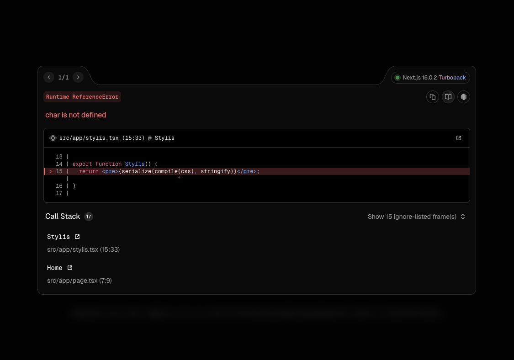

This is a minimal reproduction repository for a Turbopack issue related to caniuse-lite and browserslist data.

## How to reproduce

Just run the development server

```bash
npm run dev
```

And open http://localhost:3000/ (App Router) or http://localhost:3000/stylis (Pages Router) in your browser.

You will see the following screen:



## Conditions

The above error disappears with the following changes

- Remove `browserslist` field from `package.json`
- Or downgrade `caniuse-lite` to `1.0.30001753` or earlier
